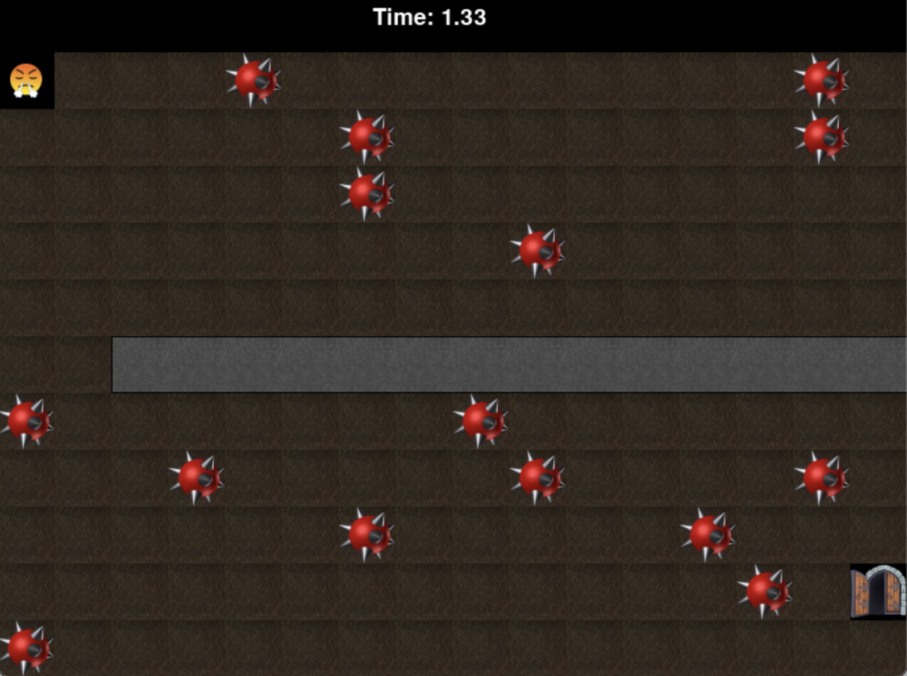

# AA3333 Game

## Overview
AA3333 is an engaging obstacle-avoidance game where players navigate a character through a series of increasingly challenging mazes to reach an exit gate. The game features multiple levels with various obstacles, including blocks, bombs, and moving barriers. Players must complete each level within a time limit, making strategic decisions to find the most efficient path to the exit.

## Game Features
- **5 Challenging Levels**: Each level presents a unique layout and increasing difficulty
- **Multiple Obstacles**: Navigate around blocks, avoid bombs, and traverse around moving barriers
- **Time-Based Challenge**: Complete each level before the timer runs out
- **Difficulty Settings**: Choose between three difficulty levels - Quiet, Gentle, and Loud
- **Score System**: Track your performance based on remaining time and obstacles avoided

## How to Play

### Controls
- **Arrow Keys**: Move the character (face) up, down, left, and right
- **Space Bar**: Advance to the next level after completion or restart after game over

### Objective
Your goal is to guide the character from the starting position to the exit gate in each level before the timer reaches zero. Avoid touching bombs as they will end your game immediately.

### Difficulty Levels
- **Quiet**: More time to complete each level (Default)
- **Gentle**: Moderate time limit
- **Loud**: Strict time limit for an intense challenge

## Game Elements
- **Face Character**: The player-controlled character
- **Exit Gate**: The goal destination for each level
- **Blocks**: Solid obstacles that define the maze
- **Bombs**: Dangerous obstacles that end your game if touched
- **Bars**: Additional barriers that must be navigated around

## Technical Information
The game was originally developed using Pygame Zero and has been reimplemented using Phaser 3, making it playable in modern web browsers.

## Installation

### Python Version (AA3333.py)
1. Ensure you have Python 3.x installed
2. Install Pygame Zero: `pip install pgzero`
3. Run the game: `python AA3333.py`

### Web Version (aa.html)
Simply open the `aa.html` file in a modern web browser to play the web version.

## Development
- Original version: Pygame Zero (Python)
- Web version: Phaser 3 (JavaScript)

## Credits
Game developed as part of a portfolio project, showcasing skills in game design and programming across multiple platforms and languages.

---

Enjoy playing AA3333! If you encounter any issues or have suggestions for improvements, please let me know.
